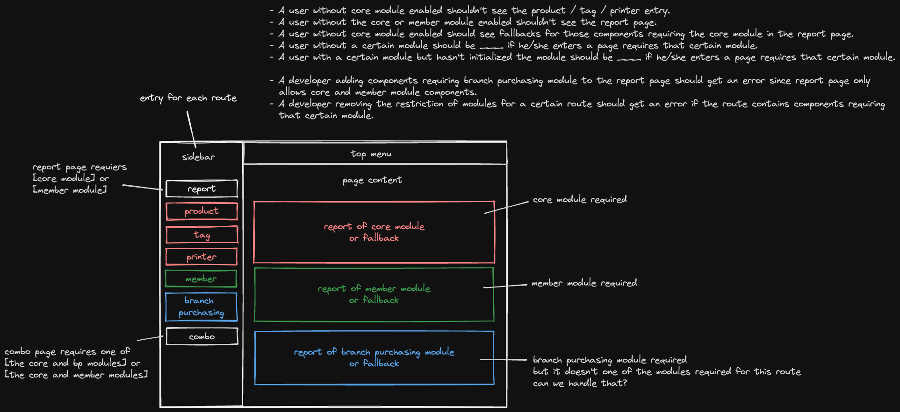
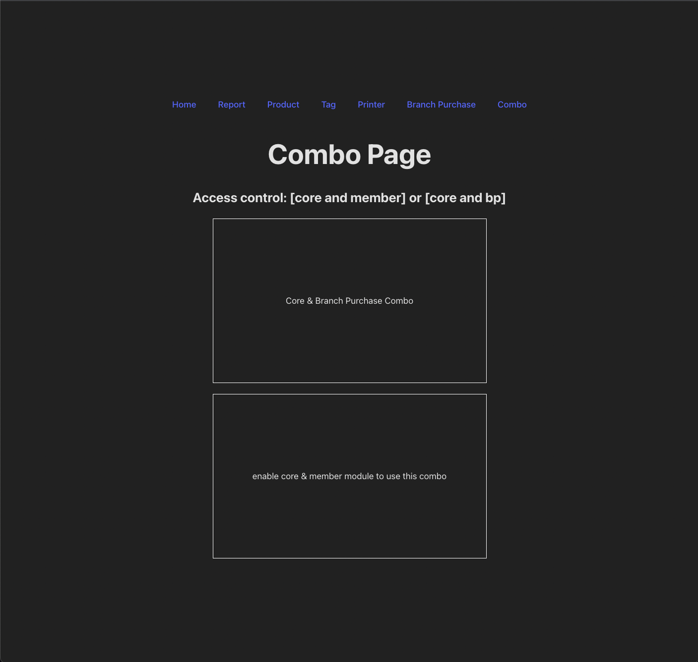

# Design Overview



# User Stories

- [menu level] A user without core module enabled shouldn't see the product / tag / printer entry.
- [page level] A user without core module enabled should see fallbacks for those components requiring the core module in the report page.
- [route level] A user without the core or member module enabled shouldn't see the report page.
- [route level] A user without a certain module should be \_\_\_ if he/she enters a page requires that certain module.
- [route level] A user with a certain module but hasn't initialized the module should be \_\_\_ if he/she enters a page requires that certain module.

- [developer experience] A developer adding components requiring branch purchasing module to the report page should get an error since report page only allows core and member module components.
- [developer experience] A developer removing the restriction of modules for a certain route should get an error if the route contains components requiring that certain module.

# Implementation Detail

## Interface

- ModuleName: `core` | `member` | ...
  - align to the module types defined in the API schema
- Rule: ModuleName[]
  - user can pass a rule if all the modules in the rule are covered by user’s modules
  - ex: user with ["core", "member"] can pass the rule ["core"]
- AccessControl: Rule[]
  - user can pass a access control if the user can pass one of the rule defined in the access control
  - ex: user with ["core"] can pass the access control [["core"], ["member"]]

## Layout Level

`getShouldBeVisible` accepts `AccessControl` and return whether should this menu item be visible or not.

```tsx
export const Menu = () => {
  const getShouldBeVisible = useMenuVisibility();

  return (
    <nav>
      <ul>
        {getShouldBeVisible([["core"], ["member"]]) && (
          <li>
            <Link to="/report">Report</Link>
          </li>
        )}

        {getShouldBeVisible([["core"]]) && (
          <>
            <li>
              <Link to="/product">Product</Link>
            </li>
            <li>
              <Link to="/tag">Tag</Link>
            </li>
            <li>
              <Link to="/printer">Printer</Link>
            </li>
          </>
        )}

        {getShouldBeVisible([
          ["core", "member"],
          ["core", "bp"],
        ]) && (
          <li>
            <Link to="/combo">Combo</Link>
          </li>
        )}
      </ul>
    </nav>
  );
};
```

## Route Level

`makeAccessControlLayout` can create different layouts with the specific `AccessControl`. 

```ts
interface IMakeAccessControlLayout {
  accessControl: AccessControl;
  redirectToWhenValidateFail?: string;
  screenForValidateFail?: React.ReactNode;
}
```

Basic usage:

```ts
const RequireCoreMemberModulesLayout = makeAccessControlLayout({
  accessControl: [["core"], ["member"]],
});

const RequireCoreModuleLayout = makeAccessControlLayout({
  accessControl: [["core"]],
});
```

We can also redirect user to another route by giving `redirectToWhenValidateFail` or show the fallback screen by giving `screenForValidateFail`.

```ts
const RequireMemberModuleLayout = makeAccessControlLayout({
  accessControl: [["member"]],
  screenForValidateFail: (
    <div className="page">
      <h1>Sorry, please upgrade your plan</h1>
    </div>
  ),
});

const ComboAccessControlLayout = makeAccessControlLayout({
  accessControl: [
    ["core", "member"],
    ["core", "bp"],
  ],
  redirectToWhenValidateFail: "/",
});
```

## Page Level

Like React’s `Suspense` component, `AccessController` lets us display a fallback if a user doesn’t pass the rule. But the best part of `AccessController` is it can prevent us from unintentionally making the conflict between route level's and page level's access control policy.

```ts
interface IAccessController {
  rule: Rule;
  fallback: React.ReactNode;
}
```

Basic usage:

```tsx
<AccessController
  rule={["core"]}
  fallback={
    <ReportSection>enable core module to see core report</ReportSection>
  }
>
  <ReportSection>Core Report</ReportSection>
</AccessController>
```

I recommend only using `AccessController` inside your page when the route level's access control has more than one rule.

# Try Yourself

1. clone this repo
2. `npm install`
3. `npm run dev`



# Cases

- We want to encourage our users to buy certain module, so we don’t want to hide the entry button. Once the user enter the member route, he / she can see our customize page `BuyMemberModulePage`.
  
  - Entry level
      
    don’t hide this entry button
    
    ```tsx
    <MenuItem to="/member">Member</MenuItem>
    ```
      
  - Route level
      
    create a layout with [[member]] access control
    
    ```tsx
    const RequireMemberModuleLayout = makeAccessControlLayout({
      accessControl: [["member"]],
      screenForValidateFail: <BuyMemberModulePage />
    })
    ```
        
- We want to show the report page for our users who have either `core` or `member` module.
    
  - Entry level
      
    ```tsx
    {canShowReport && (
      <MenuItem to="/report">Report</MenuItem>
    )}
    ```
      
  - Route level
      
    ```tsx
    const RequireMemberModuleLayout = makeAccessControlLayout({
      accessControl: [["core"], ["member"]],
      redirectToWhenValidateFail: '/dashboard'
    })
    ```
      
  - Page level
      
    use `AccessController` to ensure the user satisfies the rule
    
    ```tsx
    <AccessController
      rule={["core"]}
      fallback={
        <ReportSection>
          enable core module to see your core report
        </ReportSection>
      }
    >
      <ReportSection>Core Report</ReportSection>
    </AccessController>
    ```
    
    ```tsx
    <AccessController
      rule={["member"]}
      fallback={
        <ReportSection>
          enable core module to see your member report
        </ReportSection>
      }
    >
      <ReportSection>Member Report</ReportSection>
    </AccessController>
    ```
        
    
# Future

We can make the initialization check inside our `AccessControlLayout` because if a user hasn’t initialized a certain module, he/she shouldn’t be able to use that feature.